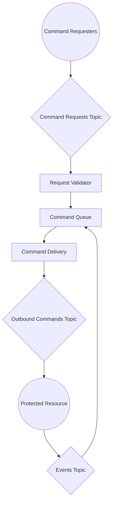

# kafka-queueing
This repository is a POC to demo the possibility of leveraging Kafka Streams to apply a rate limiting semaphore.

```mermaid
graph TB
A((Command Requesters)) -->B{Command Requests Topic}
B -->C[Request Validator]
C -->D[Command Queue]
D -->F[Command Delivery]
F -->G{Outbound Commands Topic}
G -->H((Protected Resource))
H -->I{Events Topic}
I-->D
```