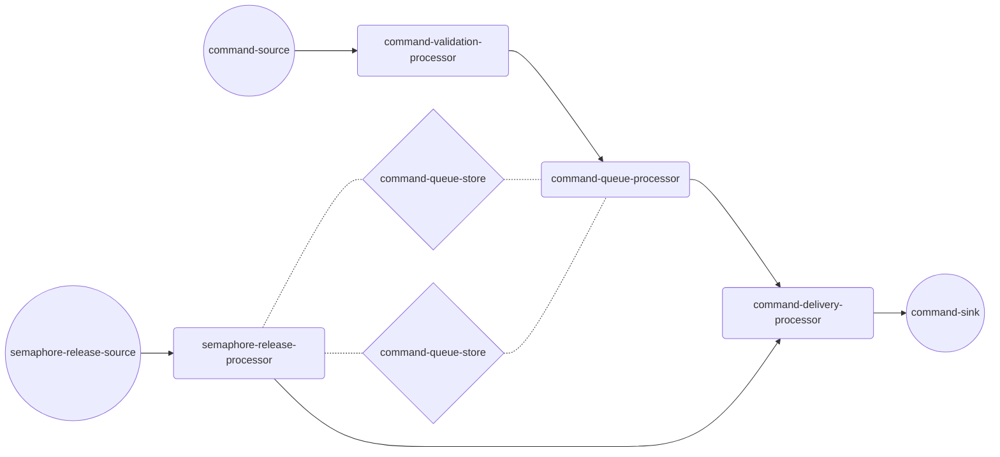

# kafka-queueing
This repository is a POC to demo the possibility of leveraging Kafka Streams to apply a rate 
limiting semaphore. If you have some resource that you wish to protect the number of 
actions/commands/messages that are sent to it at a time, a semaphore is the mechanism to control 
that flow. 

Typically, a semaphore would involve a counter, that is incremented upon access, and decremented 
on release. In distributed systems this may not always be sufficient because the signal that 
releases the semaphore may be presented multiple times depending on your systems QOS. For this 
reason, this example project uses ids of its commands as a tracking mechanism, allowing the 
validation of termination events to match a command that currently owns a semaphore.

The way this is implemented is by having two processor nodes that share state, and forward to 
the same sink. One of these processor nodes handles the incoming commands and queues them if 
there is no available semaphore. The other receives incoming events from the resource, and 
forwards the next command in the queue if a terminal event was received for a command that owned 
a semaphore. 

The topology looks like:



### How to try this project?

The docker images for this project are all prebuilt, and the Kafka dependencies are integrated 
into the helm chart in `/helm/kafka-queueing/`. You can apply that against at empty k8s 
environment (like Docker Desktop running in a k8s configuration), and it will build all the 
required containers.

Included in this project is a simple REST service intended to simplify the interaction with the 
application over the Kafka topics. You will want to port-forward to it to access its APIs.

```shell
kubectl port-forward kafka-queueing-testing-interface-0 8080
```

You can then use the following APIs to interact with the application:

```shell
# Create a new command to a random resource
curl --location --request POST 'localhost:8080/command' \
--header 'Content-Type: text/plain' \
--data-raw 'This is a message.'
### Example response
{
    "resourceId": "80169888-0e7e-4901-8099-a9fb80b7806d",
    "commandId": "275b3448-8c51-45d2-839f-4314b9700259"
}


# Create a new command to a specific resource:
curl --location --request POST 'localhost:8080/command/{resourceId}' \
--header 'Content-Type: text/plain' \
--data-raw 'You can put anything you want here.'
### Example response
{
    "resourceId": "80169888-0e7e-4901-8099-a9fb80b7806d",
    "commandId": "275b3448-8c51-45d2-839f-4314b9700259"
}


# Send a terminal event to allow the next command in the queue to access the resource
curl --location --request POST 'localhost:8080/event/{resourceId}/{commandId}'
```

You can use the following command to consume off the `command-sink`'s Kafka topic and watch new 
command access the resource.

```shell
kubectl exec --stdin --tty kafka-0 -- \
/opt/bitnami/kafka/bin/kafka-console-consumer.sh \
--bootstrap-server localhost:9092 --topic actionable-commands
```
